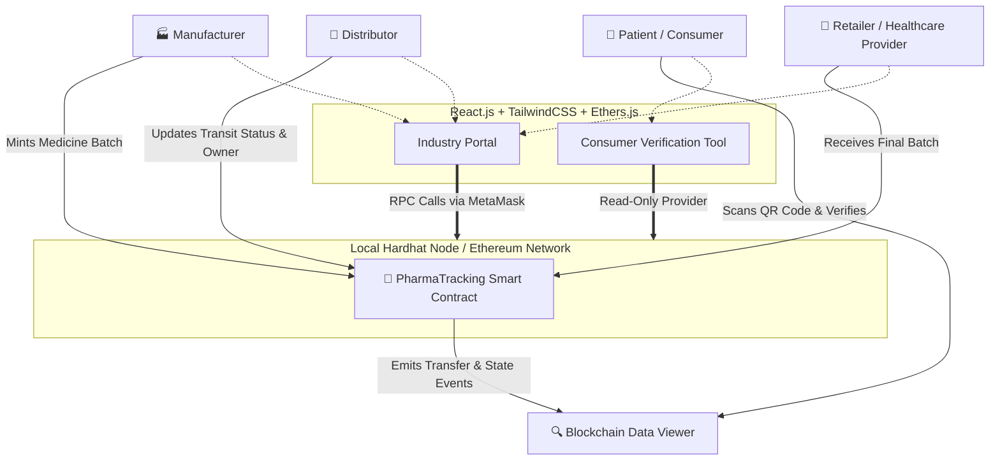

# PharmaChain 🔗💊

PharmaChain is a modern, decentralized Web3 application designed to secure the pharmaceutical supply chain. It leverages smart contracts and blockchain technology to ensure that medicines are tracked immutably from the manufacturer to the final consumer, preventing counterfeiting and ensuring safety.

## 🏗️ Architecture

PharmaChain operates on a Role-Based Access Control (RBAC) architecture, connecting physical supply chain logistics to an immutable blockchain ledger via a React/Vite Frontend.



## 🚀 Key Features

- **Role-Based Access (RBAC)**: Securely assigns industry roles (Manufacturer, Distributor, Retailer) using connected Web3 wallets. Only authorized participants can mint or transfer medicine batches.
- **Immutable Chain of Custody**: Every time a drug packaging batch changes hands, the new owner, geographical location, and precise timestamp are permanently recorded on-chain.
- **Auto-Generated QR Codes**: Instantly prints dynamic tracking QR codes once a new batch is minted directly onto the blockchain.
- **Consumer Verification**: Consumers can instantly scan QR codes with their native phone cameras to inspect the origin and journey of their medication without needing cryptocurrency or complicated wallet setups.
- **Modern UI/UX**: Designed to feel enterprise-grade utilizing React, Vite, and gorgeous semantic styling powered by Tailwind CSS.

## 🛠️ Tech Stack

- **DApp Client**: React (Vite), Tailwind CSS v4, HTML5-QRCode scanner, Lucide-React
- **Web3 Interaction**: Ethers.js v6
- **Smart Contracts**: Solidity ^0.8.20
- **Blockchain Framework**: Hardhat

## Runtime Notes

- **Recommended Node.js**: Node 22 LTS. Hardhat 2 does not officially support Node 25, and local blockchain behavior can become inconsistent on unsupported versions.
- **Recommended local wallet**: MetaMask for the Hardhat localhost workflow.
- **Phantom caveat**: Phantom can expose an EVM provider, but some Phantom builds reject adding a custom localhost HTTP RPC. The app attempts to switch or add chain `31337` automatically, but Phantom may still block the local network at the wallet level.
- **Contract config bridge**: Every local deploy rewrites `frontend/src/config.json` with the latest contract address and ABI. This file is part of the local run flow.

## 📁 Project Structure

- `frontend/`: React + Vite user interface
- `blockchain/`: Hardhat project, contract source, deployment script, artifacts, and local chain config
- `blockchain/contracts/PharmaTracking.sol`: main smart contract
- `blockchain/scripts/deploy.js`: deploys the contract and updates `frontend/src/config.json`
- `frontend/src/config.json`: frontend contract address + ABI consumed by the app

## ⚙️ Local Setup

### 1. Clone The Repository

```bash
git clone https://github.com/Pixie-19/Pharma-Chain.git
cd Pharma-Chain
```

### 2. Prerequisites (skip if already installed)

Install the following on your machine before starting:

- Node.js 22 LTS
- `pnpm` or `npm`
- A browser wallet such as MetaMask

If you use `nvm`, this repository already includes `.nvmrc`:

```bash
nvm use
```

If Node 22 is not installed yet:

```bash
nvm install 22
nvm use 22
```

### 3. Install Dependencies

Open a terminal at the repository root and install dependencies in both workspaces.

Using `pnpm`:

```bash
cd blockchain
pnpm install

cd ../frontend
pnpm install
```

Using `npm`:

```bash
cd blockchain
npm install

cd ../frontend
npm install
```

Important:

- Prefer using a single package manager consistently for a given session.
- If you switch between `npm` and `pnpm`, expect lockfile churn and `node_modules` differences.

## ▶️ Run The Entire Project Locally

You need **three terminals** for the full local workflow.

### Terminal 1: Start Hardhat Local Blockchain

```bash
cd blockchain
pnpm exec hardhat node
```

Or with npm:

```bash
cd blockchain
npx hardhat node
```

What this does:

- Starts a local Ethereum-compatible RPC server at `http://127.0.0.1:8545/`
- Uses Chain ID `31337`
- Prints funded development accounts and private keys for testing

Keep this terminal running.

### Terminal 2: Deploy The Smart Contract

With the local Hardhat node still running:

```bash
cd blockchain
pnpm exec hardhat run scripts/deploy.js --network localhost
```

Or with npm:

```bash
cd blockchain
npx hardhat run scripts/deploy.js --network localhost
```

What this does:

- Deploys `PharmaTracking.sol` to the local Hardhat chain
- Reads the generated contract artifact
- Rewrites `frontend/src/config.json` with:
    - deployed contract address
    - latest ABI

Expected result:

- The terminal prints `PharmaTracking deployed to ...`
- The terminal also prints that frontend configuration was written to `frontend/src/config.json`

Important:

- Run this step every time you reset the local blockchain.
- If you restart Hardhat node from scratch, the frontend must be re-bridged by running the deploy script again.

### Terminal 3: Start The Frontend

```bash
cd frontend
pnpm run dev
```

Or with npm:

```bash
cd frontend
npm run dev
```

Open the URL printed by Vite, typically:

```text
http://localhost:5173
```

## 👛 Wallet Setup For Local Development

### Recommended Option: MetaMask

1. Open MetaMask.
2. Add or switch to `Localhost 8545`.
3. Confirm the network uses Chain ID `31337`.
4. Import one of the funded private keys printed by `hardhat node`.
5. Open `http://localhost:5173`.
6. Connect the wallet from the Industry Portal.

The app tries to switch the wallet automatically to the local Hardhat network. If that fails, switch manually inside the wallet.

### Phantom Notes

Phantom may inject an EVM provider, but some Phantom builds refuse local custom HTTP RPC networks. The app handles Phantom detection and shows a clearer error, but if Phantom rejects localhost entirely, use MetaMask for local testing.

## 🧪 Full Local Workflow

Once everything is running:

1. Go to the Industry Portal.
2. Connect your wallet.
3. Register a role:
     - Manufacturer
     - Distributor
     - Retailer / Healthcare Provider
4. As a Manufacturer, create a medicine batch.
5. The app generates a QR code for the batch.
6. Use ownership transfer actions to move the batch through the supply chain.
7. Open the Customer / Verify view.
8. Enter the batch ID or scan the QR code.
9. Review the batch history and current owner directly from the blockchain.

## 🔄 Typical Restart Sequence

If you shut everything down and want to start fresh again:

1. Start Hardhat node.
2. Redeploy the contract.
3. Start the frontend.
4. Reconnect your wallet to `Localhost 8545`.

If you skip redeployment after resetting the local node, the frontend may point to an old contract address and contract reads or writes will fail.

## 🌐 Optional Sepolia Configuration

The Hardhat config also includes a Sepolia network entry for optional non-local usage.

Create a `.env` file inside `blockchain/` using `blockchain/.env.example` as a base:

```bash
cd blockchain
cp .env.example .env
```

Then fill in:

- `PRIVATE_KEY`
- `SEPOLIA_RPC_URL`

This is **not required** for normal local development.

## 🛠️ Useful Commands

### Frontend

```bash
cd frontend
pnpm run dev
pnpm run lint
pnpm run build
```

### Blockchain

```bash
cd blockchain
pnpm exec hardhat node
pnpm exec hardhat run scripts/deploy.js --network localhost
```

## Troubleshooting

### Wallet says wrong network

Cause:

- Wallet is not on Chain ID `31337`
- Wallet refused the local chain switch request

Fix:

1. Switch wallet to `Localhost 8545`
2. Confirm the RPC URL is `http://127.0.0.1:8545/`
3. Retry the wallet connection

### Frontend loads but blockchain actions fail

Cause:

- Contract was not redeployed after restarting local Hardhat
- `frontend/src/config.json` is stale

Fix:

1. Ensure Hardhat node is running
2. Re-run deployment script
3. Refresh the frontend

### Customer verification cannot find a batch

Cause:

- Wrong batch ID
- Local blockchain was reset
- Frontend is connected to stale contract config

Fix:

1. Recreate the batch after redeploying
2. Verify `frontend/src/config.json` was regenerated by the deploy script

### Hardhat behaves inconsistently or fails unexpectedly

Cause:

- Unsupported Node version

Fix:

1. Switch to Node 22
2. Reinstall dependencies if needed

## ✅ Minimum Local Checklist

Before testing the app, confirm all of the following are true:

- Node 22 is active
- `blockchain/node_modules` is installed
- `frontend/node_modules` is installed
- Hardhat node is running on `127.0.0.1:8545`
- Contract deployment completed successfully
- `frontend/src/config.json` was updated by the deploy script
- Wallet is connected to Chain ID `31337`
- The frontend is running on Vite
