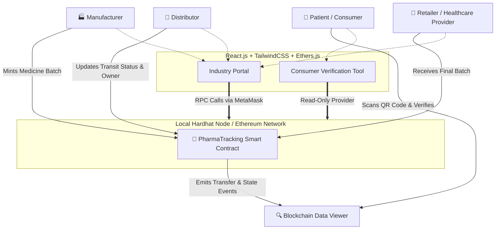

# PharmaChain 🔗💊

PharmaChain is a modern, decentralized Web3 application designed to secure the pharmaceutical supply chain. It leverages smart contracts and blockchain technology to ensure that medicines are tracked immutably from the manufacturer to the final consumer, preventing counterfeiting and ensuring safety.

## 🏗️ Architecture

PharmaChain operates on a Role-Based Access Control (RBAC) architecture, connecting physical supply chain logistics to an immutable blockchain ledger via a React/Vite Frontend.



## 🚀 Key Features

- **Role-Based Access (RBAC)**: Securely assigns industry roles (Manufacturer, Distributor, Retailer) using connected Web3 wallets. Only authorized participants can mint or transfer medicine batches.
- **Immutable Chain of Custody**: Every time a drug packaging batch changes hands, the new owner, geographical location, and precise timestamp are permanently recorded on-chain.
- **Auto-Generated QR Codes**: Instantly prints dynamic tracking QR codes once a new batch is minted directly onto the blockchain.
- **Consumer Verification**: Consumers can instantly scan QR codes with their native phone cameras to inspect the origin and journey of their medication without needing cryptocurrency or complicated wallet setups.
- **Modern UI/UX**: Designed to feel enterprise-grade utilizing React, Vite, and gorgeous semantic styling powered by Tailwind CSS.

## 🛠️ Tech Stack

- **DApp Client**: React (Vite), Tailwind CSS v4, HTML5-QRCode scanner, Lucide-React
- **Web3 Interaction**: Ethers.js v6
- **Smart Contracts**: Solidity ^0.8.20
- **Blockchain Framework**: Hardhat

## ⚙️ How to Run Locally

### 1. Start the Local Blockchain
Navigate to the `blockchain` folder and run the localized Hardhat environment. This will spin up a testing RPC at `http://127.0.0.1:8545/`:
```bash
cd blockchain
npx hardhat node
```

### 2. Deploy the Smart Contract
Keep the node running. Open a **new** terminal, navigate to the `blockchain` folder, and run your automated deployment script:
```bash
cd blockchain
npx hardhat run scripts/deploy.js --network localhost
```
*Take note of the outputted contract address to ensure it matches the one specified in `frontend/src/App.jsx`.*

### 3. Start the Web Interface
Open a **new** terminal window, navigate to the `frontend` directory, install packages if you haven't, and fire up Vite:
```bash
cd frontend
npm install
npm run dev
```

### 4. Configure Your Wallet Settings
1. Connect to `http://localhost:5173`.
2. To test the "Industry Portal", you will need [MetaMask](https://metamask.io/) installed inside your browser.
3. Switch your MetaMask network configuration to **Localhost 8545 (Chain ID 31337)**. Do not test on Sepolia as the addresses will trigger safety protocols.
4. Import one of the dummy Private Keys supplied by the `npx hardhat node` terminal output into MetaMask.
5. Create your drugs, distribute them, jump over to the consumer view, and interact with your brand new decentralized app!
